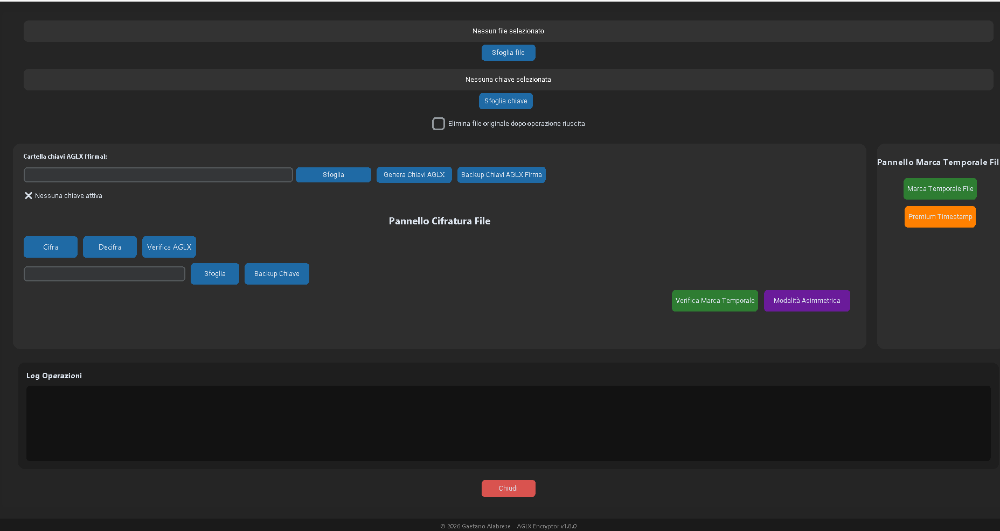

  

<h1 align="center">🔐 AGLX Encryptor</h1>

  <strong>Secure file encryption and protection for Windows</strong>

  Developed by <strong>Gaetano Alabrese</strong>

  

---

## 📸 Application

  

---

## 🔐 Features

AGLX Encryptor is a Windows application designed to provide secure file protection using modern cryptographic mechanisms.

### Current Free Version

* 🔑 **RSA 2048-bit encryption**
* 🛡️ Secure file protection
* 🔐 **SHA-256** integrity verification
* 📦 Proprietary **`.aglx`** encrypted file format
* ⏱️ **RFC 3161** trusted timestamping
* 📄 **PDF reports**
* 🪟 Designed for **Windows**
* 🆓 Free version available through the Microsoft Store

---

## 🛡️ Security

AGLX Encryptor is designed with security and data integrity in mind.

The application combines encryption, cryptographic hashing and trusted timestamping to provide an additional layer of protection and verification for protected files.

Private cryptographic material and application-sensitive components are **not included in this public repository**.

---

## ⭐ Premium

AGLX Encryptor also includes additional Premium functionality.

The Premium functionality is currently **disabled in the Free version** and is intended to be activated through a valid license.

Implementation details and Premium components are intentionally kept private.

---

## 💻 Platform

| Platform        | Availability        |
| --------------- | ------------------- |
| Windows         | ✅ Available         |
| Microsoft Store | ✅ Available         |
| Free Version    | ✅ Available         |
| Premium         | 🔒 License required |

---

## 📥 Download

Get AGLX Encryptor from the official Microsoft Store:

  

---

## 📌 Project Status

**Current version:** Free
**Source code:** Private
**Distribution:** Microsoft Store
**Project type:** Windows Desktop Application

This repository is a **public showcase** for AGLX Encryptor.

The application source code, Premium implementation and other private development components are not included in this repository.

---

## 👨‍💻 Developer

**Gaetano Alabrese**

AGLX Encryptor is an independent software project developed for Windows.

---

© Gaetano Alabrese — AGLX Encryptor

